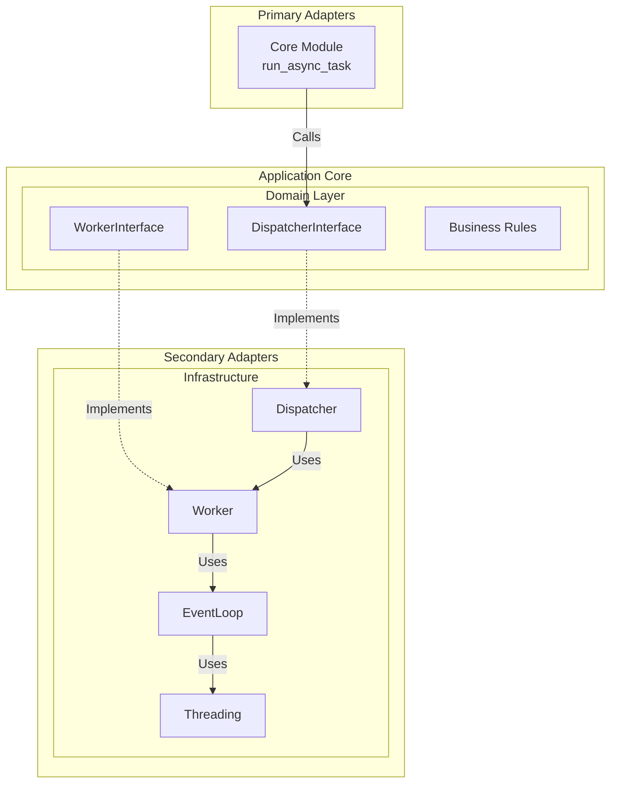
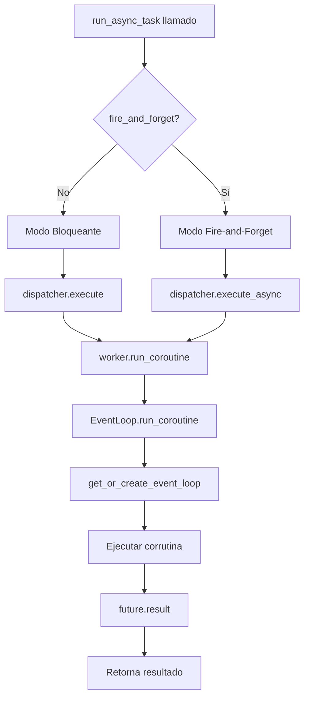

# Arquitectura y Guía Técnica - Sincpro Async Worker

## 1. Onboarding Rápido

- **Clona el repositorio y ejecuta las dependencias (`pip install -e .`).**
- **Estructura principal:**
  - `sincpro_async_worker/core.py`: Punto de entrada principal (`run_async_task`).
  - `sincpro_async_worker/domain/`: Interfaces y contratos del dominio.
  - `sincpro_async_worker/infrastructure/`: Implementaciones concretas (Dispatcher, Worker, EventLoop).
- **Para usar la librería:** Importa `run_async_task` y ejecuta tus corrutinas desde código síncrono.
- **Para contribuir:** Sigue los patrones DDD y Hexagonal existentes, agrega tests para nueva funcionalidad.

---

## 2. Problema y Solución

### 2.1 Problema Técnico
**Ejecutar código asíncrono desde contextos síncronos** sin bloquear el hilo principal y sin conflictos con event loops existentes.

```python
# ❌ Problemático: ¿Cómo ejecutar esto desde código síncrono?
async def fetch_data():
    async with httpx.AsyncClient() as client:
        return await client.get("https://api.example.com/data")

# ❌ No funciona en contexto síncrono
result = await fetch_data()  # SyntaxError

# ❌ Conflictos con event loop existente
result = asyncio.run(fetch_data())  # RuntimeError
```

### 2.2 Solución
**Thread-Safe Async Bridge** que permite ejecutar corrutinas asyncio desde código síncrono:

```python
from sincpro_async_worker import run_async_task

# ✅ Solución: Ejecución bloqueante
result = run_async_task(fetch_data())

# ✅ Solución: Fire-and-forget (no bloquea)
future = run_async_task(fetch_data(), fire_and_forget=True)
result = future.result(timeout=10)
```

---

## 3. Arquitectura y Componentes

### 3.1 Arquitectura Hexagonal



### 3.2 Componentes Principales

| Componente | Archivo | Responsabilidad |
|------------|---------|-----------------|
| **Core Module** | `core.py` | Punto de entrada, manejo del dispatcher global |
| **Dispatcher** | `infrastructure/dispatcher.py` | Coordinación sync/async, manejo de timeouts |
| **Worker** | `infrastructure/worker.py` | Abstracción de ejecución, delega al EventLoop |
| **EventLoop** | `infrastructure/event_loop.py` | Gestión inteligente de event loops |

### 3.3 Interfaces del Dominio

| Interface | Archivo | Métodos Clave |
|-----------|---------|---------------|
| **DispatcherInterface** | `domain/dispatcher.py` | `execute()`, `execute_async()` |
| **WorkerInterface** | `domain/worker.py` | `start()`, `run_coroutine()`, `shutdown()` |

---

## 4. Flujos de Ejecución

### 4.1 Flujo Básico



### 4.2 Gestión de Event Loops

**EventLoop Intelligence** - La característica clave que previene conflictos:

```python
def get_or_create_event_loop() -> asyncio.AbstractEventLoop:
    """
    Función standalone que detecta loops existentes o crea nuevos.
    Comportamiento context-aware:
    
    1. Si hay un loop corriendo (asyncio.run()) → Lo reutiliza
    2. Si hay un loop del thread pero no corriendo → Lo usa  
    3. Si no hay ninguno → Crea uno nuevo
    """
```

**Ownership Tracking:**
- `_owns_loop = True`: EventLoop creó el loop, puede cerrarlo
- `_owns_loop = False`: EventLoop reutiliza loop externo, NO lo cierra

### 4.3 Manejo de Errores

**Graceful Degradation Pattern:**

```
EventLoop falla → Warning + return None
     ↓
Worker recibe None → Propaga None
     ↓  
Dispatcher recibe None → RuntimeError claro
     ↓
Tu código → Maneja la excepción normalmente
```

---

## 5. Testing Strategy

### 5.1 Test Pyramid

```
tests/
├── test_base.py              # End-to-end scenarios
├── test_dispatcher.py        # Integration tests
├── test_worker.py            # Unit tests
├── test_event_loop.py        # Abstraction tests
└── test_event_loop_threading.py  # Implementation tests
```

### 5.2 Principios de Testing

- **Separación por capas:** Domain vs Infrastructure
- **Context-aware:** Tests que funcionan en pytest y producción
- **Graceful degradation:** Tests verifican comportamiento de fallo

---

## 6. Decisiones Técnicas

### 6.1 Patrones Implementados

| Patrón | Aplicación | Beneficio |
|--------|------------|-----------|
| **Graceful Degradation** | EventLoop → Warning + None | No tumba la aplicación |
| **Context Awareness** | Detección automática de entorno | Funciona en pytest y producción |
| **Resource Ownership** | Solo cierra recursos propios | Previene conflictos |
| **Optional Return Types** | `Optional[Awaitable[T]]` | Falla controlada sin excepciones |

### 6.2 Limitaciones y Consideraciones

| Aspecto | Descripción |
|---------|-------------|
| **Environment Dependency** | Comportamiento varía entre pytest/producción |
| **Loop Ownership** | Gestión de recursos según ownership |
| **Threading** | EventLoop puede o no crear threads |
| **Graceful Degradation** | Errores se propagan como None, no excepciones |

---

## 7. Uso y Recomendaciones

### 7.1 Casos de Uso Ideales

- **Llamadas HTTP** desde código síncrono
- **Consultas a bases de datos async** en contextos síncronos
- **Integrar librerías async** en aplicaciones síncronas existentes
- **APIs REST** que necesitan llamar servicios async internamente

### 7.2 Limitaciones

- **No usar para tareas CPU intensivas** (usa multiprocessing)
- **No usar para sistemas distribuidos** (usa Celery, RabbitMQ)
- **Límite de concurrencia:** ~10k tareas concurrentes

### 7.3 Buenas Prácticas

1. **Usa timeouts siempre**: `run_async_task(task, timeout=30)`
2. **Fire-and-forget para paralelismo**: No esperes resultados inmediatos
3. **Maneja excepciones**: Los errores se propagan normalmente
4. **Un dispatcher por proceso**: No crear múltiples instancias

---

## 8. Documentación Técnica Avanzada

### 8.1 Estrategia de Event Loop

**Documento**: [`architecture/event_loop_strategy.md`](architecture/event_loop_strategy.md)

**Thread Dedicado Siempre** - La ÚNICA estrategia técnicamente viable:

- **Restricción de Python**: Un thread = un event loop máximo
- **Aislamiento total**: Zero interferencias con contextos externos  
- **Type consistency**: Siempre retorna `concurrent.futures.Future`
- **Universal**: Funciona en scripts, Jupyter, FastAPI

```python
# Implementación simplificada
class EventLoop:
    def run_coroutine(self, coro):
        # SIEMPRE cross-thread execution
        return asyncio.run_coroutine_threadsafe(coro, self._loop)
```

### 8.2 Evaluación de Return Types

**Documento**: [`architecture/return_type_analysis.md`](architecture/return_type_analysis.md)

**Análisis matriz cuantitativa** de opciones de retorno:

| Estrategia | Score | Veredicto |
|------------|-------|-----------|
| `concurrent.futures.Future` | **61/70 (87%)** | ✅ **GANADOR** |
| `asyncio.Task` | 40/70 (57%) | ❌ Incompatible sync |
| Direct Result `T` | 45/70 (64%) | ❌ Bloquea async |

**Justificación**: `Future` es thread-safe, universal, y consistente en todos los contextos.

## 9. Conclusiones

**Sincpro Async Worker** resuelve el problema común de ejecutar código async desde contextos síncronos mediante:

1. **Thread Dedicado Strategy** - ÚNICA solución técnicamente viable en Python
2. **Future-Based Returns** - Type consistency y thread safety garantizada
3. **API Simple** - Una función, dos modos de uso
4. **Zero Configuration** - Funciona out-of-the-box en cualquier contexto
5. **Graceful Degradation** - Falla elegantemente, no fatalmente

La implementación sigue principios de arquitectura hexagonal y DDD, con decisiones técnicas respaldadas por análisis cuantitativo y limitaciones del lenguaje Python.
