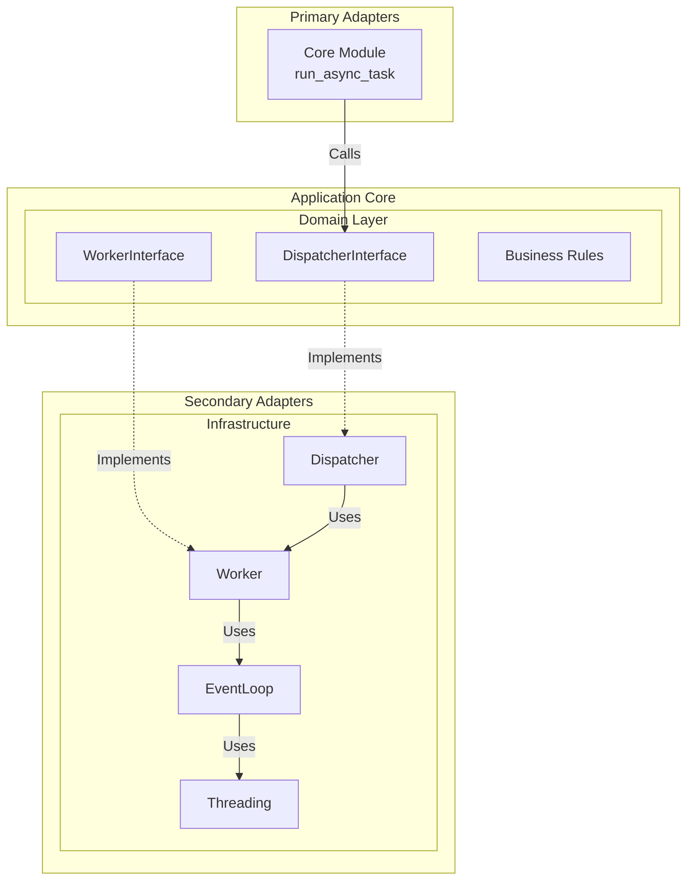
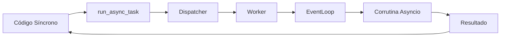
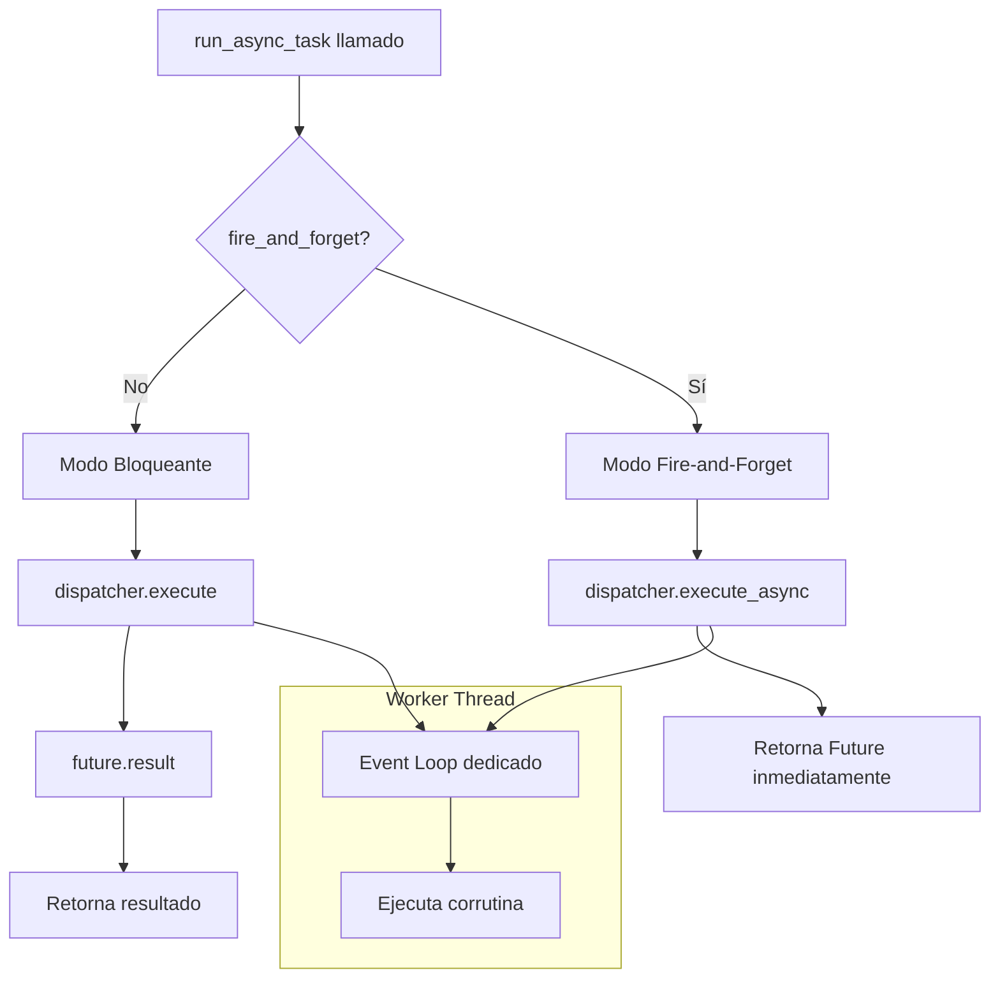
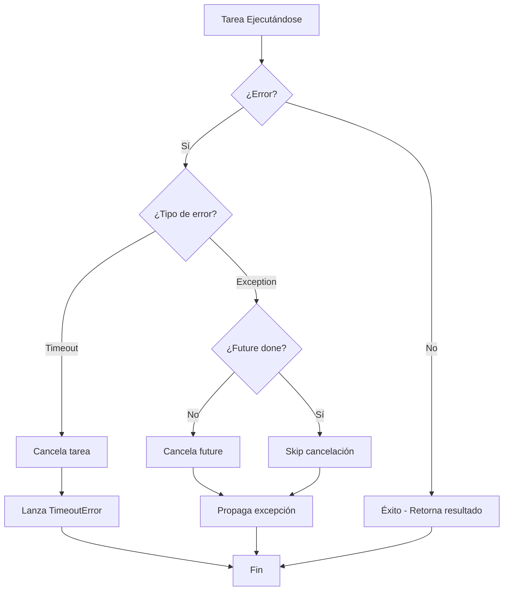
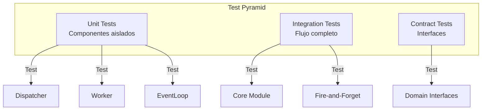

# Arquitectura y Guía Técnica - Sincpro Async Worker

## 1. Onboarding Rápido

- **Clona el repositorio y ejecuta las dependencias (`pip install -e .`).**
- **Estructura principal:**
  - `sincpro_async_worker/core.py`: Punto de entrada principal (`run_async_task`).
  - `sincpro_async_worker/domain/`: Interfaces y contratos del dominio.
  - `sincpro_async_worker/infrastructure/`: Implementaciones concretas (Dispatcher, Worker, EventLoop).
- **Para usar la librería:** Importa `run_async_task` y ejecuta tus corrutinas desde código síncrono.
- **Para contribuir:** Sigue los patrones DDD y Hexagonal existentes, agrega tests para nueva funcionalidad.

---

## 2. Problema y Solución

### 2.1 Problema Técnico
**Ejecutar código asíncrono desde contextos síncronos** sin bloquear el hilo principal:

```python
# ❌ Problemático: ¿Cómo ejecutar esto desde código síncrono?
async def fetch_data():
    async with httpx.AsyncClient() as client:
        return await client.get("https://api.example.com/data")

# ❌ No funciona en contexto síncrono
result = await fetch_data()  # SyntaxError

# ❌ Bloquea todo el proceso
result = asyncio.run(fetch_data())  # Conflictos con event loop existente
```

### 2.2 Solución
**Thread-Safe Async Bridge** que permite ejecutar corrutinas asyncio desde código síncrono:

```python
from sincpro_async_worker import run_async_task

# ✅ Solución: Ejecución bloqueante
result = run_async_task(fetch_data())

# ✅ Solución: Fire-and-forget (no bloquea)
future = run_async_task(fetch_data(), fire_and_forget=True)
result = future.result(timeout=10)  # Obtener resultado cuando necesites
```

---

## 3. Arquitectura y Componentes

### 3.1 Arquitectura Hexagonal



### 3.2 Componentes Principales

| Componente | Archivo | Responsabilidad |
|------------|---------|-----------------|
| **Core Module** | `core.py` | Punto de entrada, manejo del dispatcher global |
| **Dispatcher** | `infrastructure/dispatcher.py` | Coordinación y error handling |
| **Worker** | `infrastructure/worker.py` | Gestión del thread y ejecución de corrutinas |
| **EventLoop** | `infrastructure/event_loop.py` | Manejo del asyncio event loop |

### 3.3 Interfaces del Dominio

| Interface | Archivo | Métodos Clave |
|-----------|---------|---------------|
| **DispatcherInterface** | `domain/dispatcher.py` | `execute()`, `execute_async()` |
| **WorkerInterface** | `domain/worker.py` | `start()`, `run_coroutine()`, `shutdown()` |

---

## 4. Flujos de Ejecución

### 4.1 Flujo General



### 4.2 Flujo Detallado por Modo



### 4.3 Gestión de Errores



---

## 5. Patrones de Diseño Aplicados

### 5.1 Patrones Arquitectónicos

| Patrón | Implementación | Beneficio |
|--------|---------------|-----------|
| **Hexagonal Architecture** | Interfaces en `domain/`, implementaciones en `infrastructure/` | Aislamiento del dominio |
| **Dependency Inversion** | `Dispatcher` depende de `DispatcherInterface` | Testabilidad y flexibilidad |
| **Singleton** | Dispatcher global en `core.py` | Simplicidad de uso |

### 5.2 Patrones de Diseño

| Patrón | Componente | Uso |
|--------|------------|-----|
| **Bridge** | `Dispatcher` | Conecta código síncrono con asíncrono |
| **Adapter** | `Core Module` | Adapta llamadas síncronas al dominio |
| **Strategy** | `run_async_task` | Diferentes estrategias de ejecución |
| **Template Method** | `EventLoop` | Ciclo de vida del event loop |

---

## 6. Uso y Ejemplos

### 6.1 Casos de Uso Principales

| Caso de Uso | Código | Cuándo Usar |
|-------------|--------|-------------|
| **Ejecución Simple** | `result = run_async_task(async_func())` | Necesitas el resultado inmediatamente |
| **Con Timeout** | `result = run_async_task(async_func(), timeout=5.0)` | Operaciones que pueden colgarse |
| **Fire-and-Forget** | `future = run_async_task(async_func(), fire_and_forget=True)` | No necesitas esperar el resultado |
| **Fire-and-Forget con Resultado** | `future = run_async_task(..., fire_and_forget=True)`<br/>`result = future.result(timeout=10)` | Quieres iniciar rápido pero obtener resultado después |

### 6.2 Ejemplo Práctico

```python
import asyncio
import httpx
from sincpro_async_worker import run_async_task

# Función asíncrona de ejemplo
async def fetch_multiple_urls(urls):
    async with httpx.AsyncClient() as client:
        tasks = [client.get(url) for url in urls]
        responses = await asyncio.gather(*tasks)
        return [r.json() for r in responses]

# Desde código síncrono (ej: Django view, Flask route)
def sync_view():
    urls = ["https://api1.com", "https://api2.com", "https://api3.com"]
    
    # Opción 1: Esperar resultado
    results = run_async_task(fetch_multiple_urls(urls), timeout=10.0)
    
    # Opción 2: Fire-and-forget, obtener después
    future = run_async_task(fetch_multiple_urls(urls), fire_and_forget=True)
    # ... hacer otras cosas ...
    results = future.result(timeout=10.0)
    
    return results
```

---

## 7. Testing y Desarrollo

### 7.1 Estrategia de Testing



### 7.2 Comandos de Desarrollo

```bash
# Ejecutar todos los tests
pytest

# Tests específicos
pytest tests/test_base.py -v
pytest tests/test_dispatcher.py -v -k "fire_and_forget"

# Coverage
pytest --cov=sincpro_async_worker

# Linting
ruff check sincpro_async_worker/
mypy sincpro_async_worker/
```

---

## 8. Decisiones Técnicas Clave

### 8.1 Trade-offs Principales

| Decisión | ✅ Beneficios | ❌ Trade-offs |
|----------|---------------|---------------|
| **Thread separado** | Aislamiento, no conflictos | Overhead de thread |
| **concurrent.futures.Future** | Thread-safe, compatible con código síncrono | No compatible con await |
| **Singleton dispatcher** | Simplicidad de uso | Menos flexibilidad |
| **Cleanup automático** | Sin intervención del usuario | No determinístico |

### 8.2 Limitaciones y Características

| Aspecto | Límite/Característica |
|---------|----------------------|
| **Threads** | 1 worker thread por proceso |
| **Concurrencia** | ~10k tareas concurrentes (límite del event loop) |
| **Persistencia** | No hay - solo ejecución en memoria |
| **Distribución** | No soportada - un solo proceso |
| **Optimización** | I/O bound tasks, no CPU intensive |

---

## 9. Consejos y Buenas Prácticas

- **Usa fire-and-forget** cuando no necesites esperar el resultado inmediatamente.
- **Siempre maneja timeouts** para operaciones de red o que puedan colgarse.
- **No uses para tareas CPU-intensive** - está optimizado para I/O bound.
- **Para sistemas distribuidos** considera RabbitMQ, Celery o Apache Kafka.
- **Los errores se propagan** - maneja excepciones como en código síncrono normal.
- **El cleanup es automático** - no necesitas gestionar el ciclo de vida manualmente.
- **Un dispatcher por proceso** - no intentes crear múltiples instancias.
